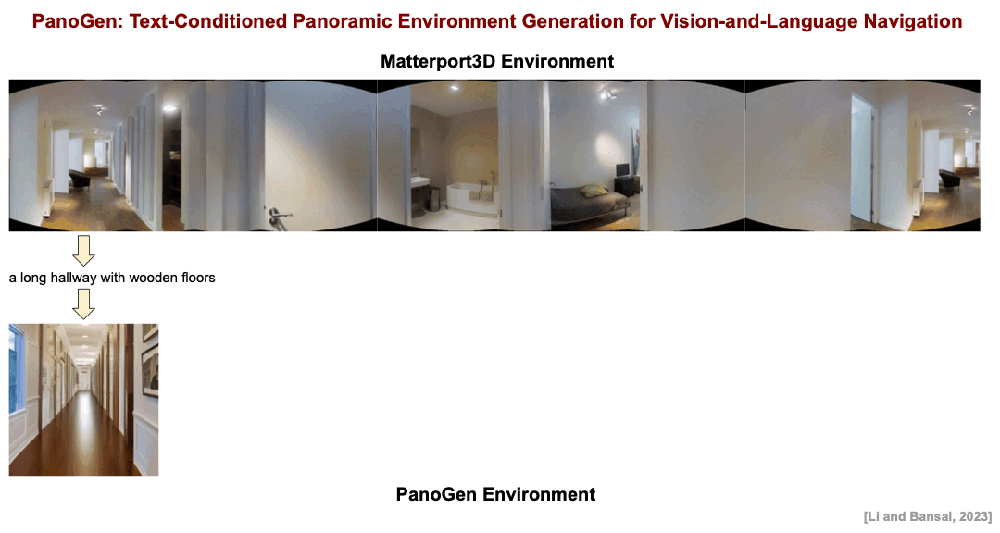

# PanoGen: Text-Conditioned Panoramic Environment Generation for Vision-and-Language Navigation

* Authors: [Jialu Li](https://jialuli-luka.github.io/) and [Mohit Bansal](https://www.cs.unc.edu/~mbansal/) (UNC Chapel Hill)

* [Paper]()

Vision-and-Language Navigation requires the agent to follow language instructions to navigate through 3D environments. One main challenge in Vision-and-Language Navigation is the limited availability of photorealistic training environments, which makes it hard to generalize to new and unseen environments.
To address this problem, we propose PanoGen, a generation method that can potentially create an infinite number of diverse panoramic environments conditioned on text. Specifically, we collect room descriptions by captioning the room images in existing Matterport3D environments, and leverage a state-of-the-art text-to-image diffusion model to generate the new panoramic environments.
We use recursive outpainting over the generated images to create consistent 360-degree panorama views. Our new panoramic environments share similar semantic information with the original environments by conditioning on text descriptions, which ensures the co-occurrence of objects in the panorama follows human intuition, and creates enough diversity in room appearance and layout with image outpainting. Lastly, we explore two ways of utilizing PanoGen in VLN pre-training and fine-tuning. We generate instructions for paths in our PanoGen environments with a speaker built on a pre-trained vision-and-language model for VLN pre-training, and augment the visual observation with our panoramic environments during agents' fine-tuning to avoid overfitting to seen environments.
Empirically, learning with our PanoGen environments achieves the new state-of-the-art on the Room-to-Room, Room-for-Room, and CVDN datasets. Besides, we find that pre-training with our PanoGen speaker data is especially effective for CVDN, which has under-specified instructions and needs commonsense knowledge to reach the target. Lastly, we show that the agent can benefit from training with more generated panoramic environments, suggesting promising results for scaling up the PanoGen environments to enhance agents' generalization to unseen environments.

<p align="center">

</p>


## Step1: Caption R2R images

1. Follow the instructions [here](https://github.com/salesforce/LAVIS) to install the environments for BLIP-2.

2. Caption the discretized images in Matterport3D or download the captioned data from [here](https://www.dropbox.com/sh/r8sju23y1qf5a0a/AAC_nVaIObU9wcvfhnHwdgvia?dl=0):

```
cd BLIP-2
python caption_generation.py
```


## Step2: Generate first image with stable diffusion

1. Follow the instructions [here](https://github.com/huggingface/diffusers) to install the environments for stable diffusion.

2. Generate first image with stable diffusion, or directly download our PanoGen environments from [here](https://www.dropbox.com/sh/r8sju23y1qf5a0a/AAC_nVaIObU9wcvfhnHwdgvia?dl=0):

```
cd Stable-diffusion
python generate_images_from_captions.py
```


## Step3: Outpaint panorama recursively

1. Recurse outpaint the panorama given first image, or directly download our PanoGen environments from [here](https://www.dropbox.com/sh/r8sju23y1qf5a0a/AAC_nVaIObU9wcvfhnHwdgvia?dl=0):

```
python image_outpainting.py
```


## Step4: Generate speaker data

1. Follow the instructions [here](https://github.com/alibaba/AliceMind/tree/main/mPLUG) to install the environments for mPLUG.

2. Train and inferene with the speaker, or download our speaker data from [here](https://www.dropbox.com/sh/r8sju23y1qf5a0a/AAC_nVaIObU9wcvfhnHwdgvia?dl=0):

```
cd mPLUG
bash scripts/vln_train.sh
bash scripts/vln_inference.sh
```


## Step5: VLN training

1. Follow the instructions [here](https://github.com/cshizhe/VLN-DUET/tree/main) to install the environments for VLN-DUET.

2. Extract the CLIP-ViT/B16 features following the instructions [here](https://github.com/jialuli-luka/EnvEdit).

3. Pre-train the agent on both the original environments (and our PanoGen environments).

```
cd VLN-DUET
cd pretrain_src
bash run_r2r.sh
```

4. Fine-tune the agent while optionally randomly replacing the original environments with our PanoGen environments.

```
cd map_nav_src
bash scripts/run_r2r.sh
bash scripts/run_r4r.sh
bash scripts/run_cvdn.sh
```

* `augwsd`: added when fine-tune with randomly replacing the original environments with PanoGen environments

* `sd_env`: path to pre-extracted image feautres of PanoGen environments

* `aug_prob`: probability of observation replacement

## Citation

If you find this work useful, please consider citing:

```bibtex
@inproceedings{li2023panogen,
  title     = {PanoGen: Text-Conditioned Panoramic Environment Generation for Vision-and-Language Navigation},
  author    = {Jialu Li, Mohit Bansal},
  booktitle = {arxiv},
  year      = {2023}
}
```
